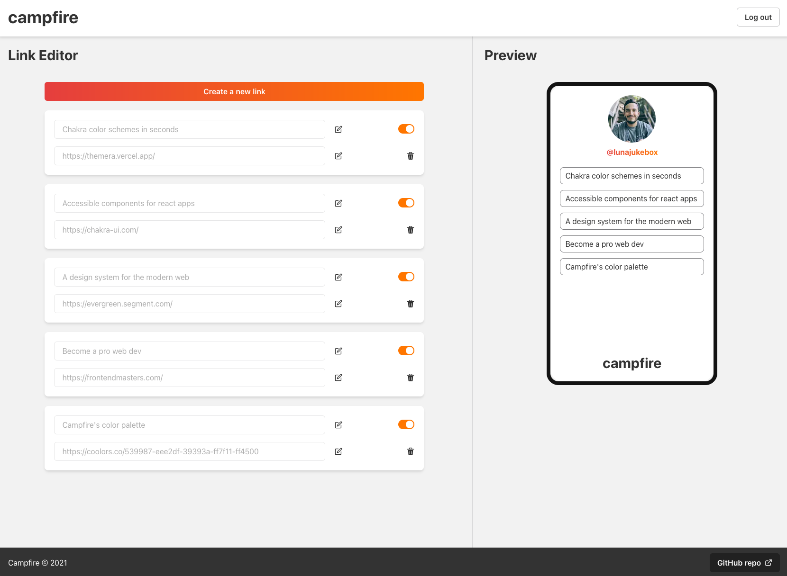

# campfire
Modern web app for sharing all your links in a single place

Inspired on [Linktree](https://linktr.ee/)

Check it out: [campfire-links](https://campfire-links.vercel.app/)

It is built with:
- Next.js for the server-side rendered admin panel, and serverless API functions
- NextAuth.js for authentication
- MongoDB and the MongoDB Node.js driver for data storage and retrieval
- Chakra UI
- TypeScript

# Screenshots
